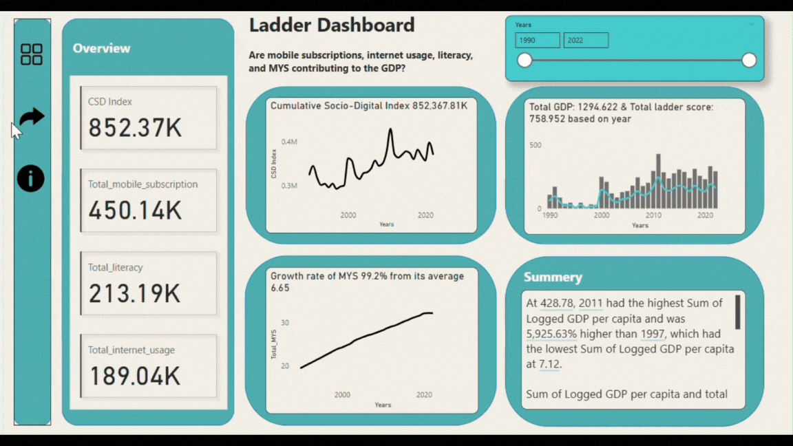

# 📊 Ladder Dashboard: Measuring Happiness Index
-*by Saikat Bhattacharjee*

## Overview
This project aims to analyze how factors like education, digital connectivity, and healthcare impact the Happiness Index. By leveraging publicly available datasets, we can gain valuable insights into the correlation between these factors and overall well-being. The dashboard presents a visual representation of the findings, helping users understand the key drivers of happiness across different countries.

## Data Sources
To build this analysis, data has been collected from reliable sources such as the World Bank, UNDP, and World Report Journals. The datasets used include:

1️⃣ **Internet Usage** (Percentage of population using the internet) - Source: [World Bank](https://lnkd.in/g9gs8HXf)  
2️⃣ **Mobile Subscriptions** (Number of mobile phone subscriptions per 100 people) - Source: [World Bank](https://lnkd.in/gvKBYXfX)  
3️⃣ **Mean Years of Schooling** (Average years of formal education received by individuals) - Source: [UNDP](https://lnkd.in/gSx8sp4x)  
4️⃣ **Adult Literacy Rate** (Percentage of literate adults in a country) - Source: [World Bank](https://lnkd.in/gw64hTKy)  
5️⃣ **Additional Data on Happiness and GDP** - Source: World Report Journals  

## Insights from the Data
🔍 After analyzing the data, the following trends have been observed:

- Countries with **higher levels of education, better internet access, and stronger healthcare systems** tend to have higher Happiness Index scores.
- Wealthier nations invest more in **education, digital infrastructure, and healthcare**, leading to higher overall life satisfaction.
- Low-income countries often struggle with inadequate access to these essential services, which negatively affects their happiness levels.
- There is a **strong correlation between GDP per capita and happiness**, but other factors like social support, life expectancy, and freedom also play a crucial role.

## Approach and Visualization
To ensure that the data is presented in an engaging and understandable way, I have incorporated storytelling techniques inspired by the book *"Storytelling With Data: A Data Visualization Guide for Business Professionals"*. This helps transform raw numbers into meaningful narratives, making it easier for audiences to interpret and act upon the insights.

## Conclusion
Understanding the factors that influence happiness is crucial for policymakers, researchers, and organizations aiming to improve quality of life worldwide. By analyzing these datasets and presenting them through an interactive dashboard, this project highlights the importance of investing in education, digital connectivity, and healthcare to enhance overall well-being.

If you have any feedback or suggestions, feel free to reach out! 😊

